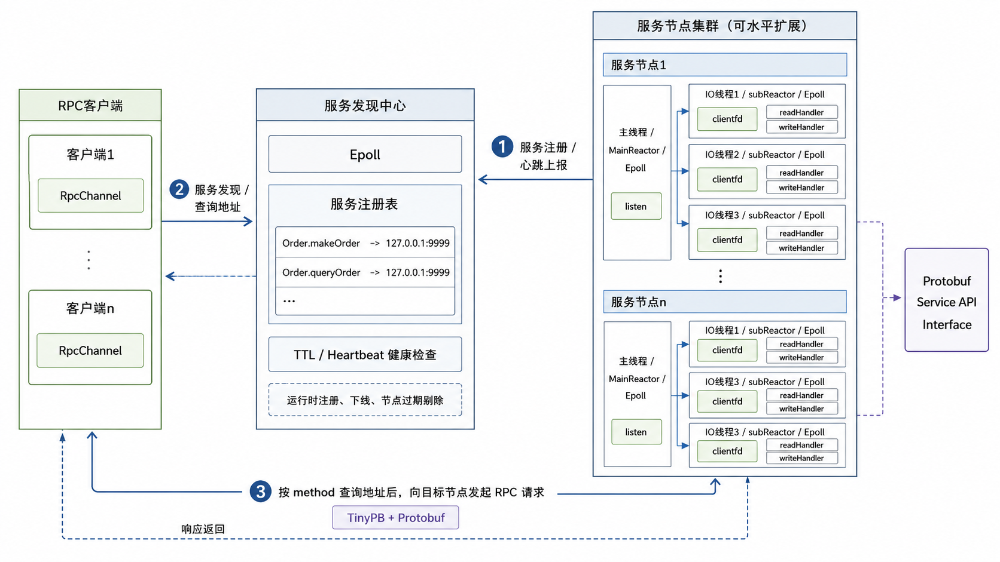

# KaiRPC

KaiRPC 是一个基于 Linux epoll 和 Protobuf 实现的轻量级异步 RPC 框架，支持远程方法调用、服务注册发现、异步日志、定时器和服务异常重启。

项目通过自定义 TinyPB 二进制协议封装 RPC 请求与响应，基于 Protobuf 完成参数和结果的序列化 / 反序列化，并通过服务发现中心维护 RPC 方法到服务节点地址的映射关系，适用于学习 Linux 网络编程、RPC 调用链路和分布式服务治理的核心实现。

## Features

- 基于 epoll 实现事件监听与分发，封装 EventLoop、FdEvent、Timer 等基础组件
- 封装 TcpServer、TcpClient、TcpConnection 和 TcpBuffer，支持异步连接管理与读写事件处理
- 基于 Protobuf 定义服务接口和消息结构，实现 RPC 请求参数和响应结果的序列化 / 反序列化
- 设计 TinyPB 自定义通信协议，封装 msg_id、method_name、error_code、error_info 和 Protobuf Body
- 支持通过 package length 解决 TCP 粘包 / 半包问题，并在解码阶段增加包长、字段长度和非法包检查
- 支持 RpcChannel、RpcController、RpcDispatcher，实现客户端远程调用、服务端方法分发和请求响应匹配
- 支持服务注册发现，维护 RPC 方法名到服务节点地址的映射关系
- 引入 heartbeat + TTL 机制，自动过滤超时服务节点，避免客户端路由到异常实例
- 支持异步日志、定时器和服务异常重启等基础高可用能力

## Architecture



服务端启动后会将本地 Protobuf Service 中的方法注册到服务发现中心，客户端调用远程方法前先查询服务地址，再通过 TCP 连接向对应 RPC 服务节点发送 TinyPB 请求包。

服务发现中心维护方法名到服务节点地址的映射，并通过 `last_seen_ms` 和 `service_ttl_ms` 判断节点是否仍然可用。服务端会周期性发送 heartbeat 刷新状态；如果节点超过 TTL 未刷新，后续查询时将被过滤。

更多设计细节见：

- [架构说明](docs/architecture.md)
- [TinyPB 协议说明](docs/protocol.md)

## Directory

```text
.
├── common/                  # 配置读取、日志、工具函数、异常处理和高可用辅助模块
├── conf/                    # 服务端、客户端和服务发现中心配置文件
├── docs/                    # 架构说明和协议文档
├── net/                     # epoll 事件循环、TCP 网络层、定时器等核心网络模块
│   ├── coder/               # TinyPB 协议对象与编解码
│   ├── rpc/                 # RpcChannel、RpcController、RpcDispatcher 等 RPC 核心模块
│   ├── service_discovery/   # 服务注册发现和运行时管理
│   └── tcp/                 # TCP 地址、连接、客户端、服务端和缓冲区
├── scripts/                 # 构建脚本
├── test/                    # 示例 RPC 服务端、客户端和 Protobuf 文件
├── CMakeLists.txt
└── README.md
```

## Environment

推荐环境：

```text
OS: Alibaba Cloud Linux 3 / CentOS-like Linux
Compiler: GCC / G++ 10+
Build Tool: CMake
Language: C++17
Dependencies: Protobuf, TinyXML, pthread
```

在 Alibaba Cloud Linux / CentOS 系统上可以参考：

```bash
yum install -y gcc gcc-c++ cmake make git
yum install -y protobuf protobuf-devel protobuf-compiler
yum install -y tinyxml-devel
```

如果系统中的 TinyXML 头文件路径为 `/usr/include/tinyxml.h`，项目中应使用：

```cpp
#include <tinyxml.h>
```

## Build

```bash
chmod +x scripts/build.sh
./scripts/build.sh
```

也可以手动构建：

```bash
rm -rf build
mkdir build
cd build
cmake ..
make -j"$(nproc)"
```

构建完成后，主要可执行文件位于：

```text
build/bin/rpc_service_discovery
build/bin/rpc_server
build/bin/rpc_client
build/bin/tinypb_codec_test
```

静态库位于：

```text
build/lib/libkairpc.a
```

## Configuration

项目主要包含三个配置文件：

```text
conf/service_center.conf      # 服务发现中心配置
conf/kairpc.xml               # RPC 服务端配置
conf/kairpc_client.xml        # RPC 客户端配置
```

默认配置使用 `127.0.0.1`，适合在单机环境中启动服务发现中心、RPC 服务端和 RPC 客户端进行联调。

服务发现中心支持 TTL 配置，例如：

```text
service_ttl_ms = 10000
```

该配置表示服务节点如果超过指定时间未刷新 heartbeat，则会在查询时被视为不可用节点。

## Quick Start

### 1. 编译项目

```bash
./scripts/build.sh
```

### 2. 启动服务发现中心

打开第一个终端：

```bash
cd KaiRPC
./build/bin/rpc_service_discovery
```

启动成功后，可以看到类似输出：

```text
service center start, query port:8080, control port:9090, ttl:10000ms
```

### 3. 启动 RPC 服务端

打开第二个终端：

```bash
cd KaiRPC
./build/bin/rpc_server
```

服务端启动后，会向服务发现中心注册示例服务方法，例如：

```text
Order.makeOrder
Order.queryOrder
```

### 4. 启动 RPC 客户端

打开第三个终端：

```bash
cd KaiRPC
./build/bin/rpc_client
```

客户端会通过服务发现中心查询目标方法地址，然后向 RPC 服务端发起远程调用。

成功时可以看到类似输出：

```text
call rpc success
request[price: 100 goods: "apple"]
response[order_id: "20231015"]
```

## Example

示例代码位于 `test/` 目录：

```text
test/order.proto              # 示例 Protobuf 服务定义
test/test_rpc_server.cc       # 示例 RPC 服务端
test/test_rpc_client.cc       # 示例 RPC 客户端
```

示例调用流程：

```text
1. order.proto 定义 OrderService 和请求 / 响应结构
2. rpc_server 注册 OrderService 到 RpcDispatcher
3. rpc_server 向服务发现中心注册 Order.makeOrder / Order.queryOrder
4. rpc_client 通过 RpcChannel 发起远程调用
5. RpcChannel 查询服务发现中心，获得目标服务地址
6. 客户端将请求封装为 TinyPB 包并发送
7. 服务端反序列化请求，调用对应 Protobuf Service 方法
8. 服务端将响应封装为 TinyPB 包返回
9. 客户端根据 msg_id 匹配响应并触发回调
```

## TinyPB Protocol

KaiRPC 使用 TinyPB 作为 RPC 通信协议。协议主要包含：

```text
start flag
package length
msg_id length + msg_id
method_name length + method_name
error_code
error_info length + error_info
protobuf serialized body
checksum
end flag
```

其中：

- `package length` 用于描述完整数据包长度，解决 TCP 粘包和半包问题
- `msg_id` 用于匹配一次 RPC 请求和对应响应
- `method_name` 用于服务端定位具体的 Protobuf Service 方法
- `error_code` 和 `error_info` 用于表达 RPC 调用失败原因
- `protobuf serialized body` 保存序列化后的请求或响应数据

更多细节见：[TinyPB 协议说明](docs/protocol.md)

## Service Discovery

服务发现中心维护一张方法名到服务节点地址的映射表：

```text
method_name -> service_addr
```

RPC 服务端启动后，会将本地服务方法注册到服务发现中心。客户端调用远程方法前，会先根据 `method_name` 查询服务地址。

KaiRPC 在服务发现模块中加入了轻量级 TTL 健康检查：

```text
ServiceNode {
    addr
    last_seen_ms
}
```

节点注册、修改或 heartbeat 时会刷新 `last_seen_ms`。客户端查询服务地址时，如果节点超过 `service_ttl_ms` 未刷新，则该节点不会被返回，并会被惰性清理。

## Verification

本项目已在 Alibaba Cloud Linux 3 环境下完成基础验证：

```text
1. 编译生成 libkairpc.a、rpc_service_discovery、rpc_server、rpc_client
2. 启动 rpc_service_discovery
3. 启动 rpc_server 并注册 Order.makeOrder / Order.queryOrder
4. 启动 rpc_client
5. 客户端成功调用 Order.makeOrder，并收到 Protobuf 响应
```

示例成功输出：

```text
call rpc success
request[price: 100 goods: "apple"]
response[order_id: "20231015"]
```

## Notes

- `build/`、`bin/`、`lib/`、`log/` 等目录为构建或运行生成内容，不建议提交到 GitHub
- 如果修改了 `test/order.proto`，需要重新生成 Protobuf 文件：

```bash
cd test
protoc --cpp_out=. order.proto
```

- 如果服务端或客户端无法连接服务发现中心，请先检查 `conf/service_center.conf`、`conf/kairpc.xml` 和 `conf/kairpc_client.xml` 中的 IP 与端口配置
- 如果客户端找不到服务，请确认启动顺序为：

```text
rpc_service_discovery -> rpc_server -> rpc_client
```
